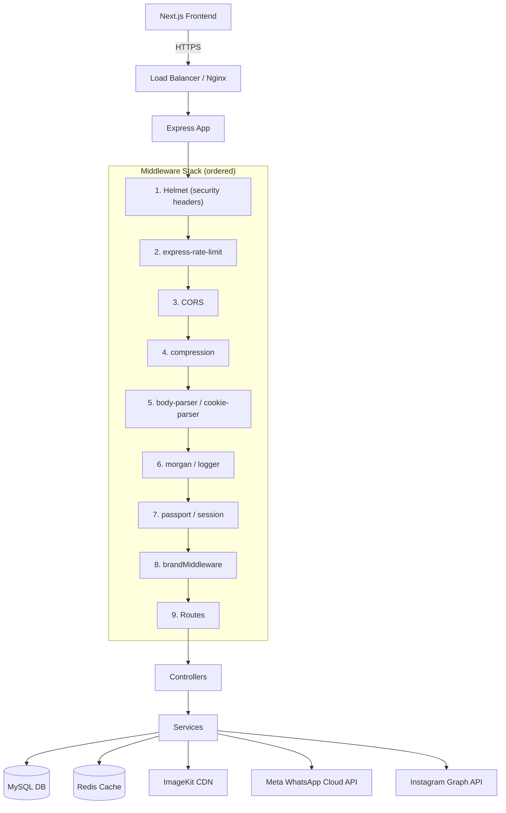

# Design: Backend Optimization, ImageKit Integration & Security Hardening

## Overview

This feature spans 24 requirements across six domains:

1. **ImageKit migration** — profile and review images moved to ImageKit CDN
2. **Performance** — Redis caching, N+1 elimination, ETag/304, lazy review loading, pagination caps
3. **Security** — Helmet, rate limiting, CORS enforcement, magic-byte validation, no credential leaks
4. **Notifications** — WhatsApp Cloud API replaces email for order lifecycle events
5. **New content features** — Lookbook, Shoppable Reels, Instagram Gallery, Mega Menu
6. **Data integrity** — AES-256-GCM encryption for PII, JWT refresh token rotation, order cancellation

The system is a Node.js/Express backend with Sequelize ORM on MySQL, Redis via ioredis, and a Next.js frontend.

---

## Architecture




### Key Design Decisions

- **Helmet first**: Security headers must be set before any route handler can send a response.
- **Rate limiter before CORS**: Prevents CORS preflight requests from consuming rate limit budget.
- **Services own caching**: Controllers call services; services handle Redis read-through/write-through. Controllers never touch Redis directly.
- **Non-blocking notifications**: WhatsApp sends are fire-and-forget (`whatsappService.send(...).catch(logger.warn)`). Order creation never fails due to notification failure.
- **Encryption at service layer**: `encryption.js` is called in the ShippingAddress and GuestUser service/controller layer, not in Sequelize hooks, to keep the ORM layer simple and avoid double-encryption bugs.

---

## Components and Interfaces

### New Services

#### `Backend/services/whatsappService.js`

```js
// Sends a pre-approved Meta template message
sendOrderConfirmation(phone, { orderNumber, itemCount, total, estimatedDelivery })
sendOrderShipped(phone, { orderNumber, awbNumber, trackingUrl })
sendOrderDelivered(phone, { orderNumber })
sendOrderCancelled(phone, { orderNumber, refundInfo })

// Internal helpers
formatE164(phone)           // "9876543210" → "+919876543210"
sendTemplate(phone, templateName, components)  // raw API call via axios
```

Env vars required: `WHATSAPP_API_TOKEN`, `WHATSAPP_PHONE_NUMBER_ID`, `WHATSAPP_BUSINESS_ACCOUNT_ID`

#### `Backend/services/instagramService.js`

```js
fetchFeed(brandId)          // fetches from Graph API, caches in Redis 1h
getCachedFeed(brandId)      // returns cached feed or fetches if missing
refreshFeed(brandId)        // force-refresh cache
refreshAccessTokenIfNeeded(brandId)  // auto-refresh when within 7 days of expiry
```

Env vars (per brand via `brand_settings`): `INSTAGRAM_ACCESS_TOKEN`, `INSTAGRAM_ACCOUNT_ID`

#### `Backend/utils/encryption.js`

```js
encrypt(plaintext)   // returns "iv:authTag:ciphertext" (hex-encoded)
decrypt(ciphertext)  // returns plaintext string, or null on failure
isEncrypted(value)   // returns true if value matches "hex:hex:hex" format
```

Env var: `DATA_ENCRYPTION_KEY` (64-char hex = 32 bytes)

### Modified Services

#### `Backend/services/productService.js`
- Re-enable `cacheManager.set` in `getProductsList` with 10-min TTL
- Cache key includes `brandId`: `products:list:${brandId}:${category}:${search}:${sort}:${page}:${limit}`
- Remove `Review` from `includeOptions` in `getProductsList` (use pre-aggregated `avg_rating`, `review_count`)
- Add filter support: `minPrice`, `maxPrice`, `inStock`, `minRating`, `attributes`

#### `Backend/services/cacheManager.js`
- No structural changes; used as-is by new services

#### `Backend/config/corsConfig.js`
- Change fallback from silent allow to `callback(new Error('Not allowed by CORS'))` in production
- Add event-based cache invalidation when brand domains change (instead of only TTL-based)

### New Controllers

- `Backend/controller/lookbookController.js` — CRUD for lookbooks, images, hotspots
- `Backend/controller/reelController.js` — CRUD for reels, product tagging, view count
- `Backend/controller/instagramController.js` — feed endpoint, manual refresh, product tagging

### Modified Controllers

- `Backend/controller/userController.js` — ImageKit upload for profile images, password strength validation, refresh token issuance
- `Backend/controller/reviewController.js` — ImageKit upload for review images, Redis cache invalidation
- `Backend/controller/orderController.js` — WhatsApp notifications, order cancellation endpoint, `console.log` → `logger.debug`
- `Backend/controller/attributeController.js` — add `getMegaMenu` handler

---

## Data Models

### New Tables

#### `lookbooks`
| Column | Type | Notes |
|---|---|---|
| id | INT PK AUTO_INCREMENT | |
| title | VARCHAR(255) NOT NULL | |
| slug | VARCHAR(255) UNIQUE NOT NULL | |
| description | TEXT | |
| status | ENUM('active','draft') DEFAULT 'draft' | |
| brand_id | INT FK → brands.id | |
| display_order | INT DEFAULT 0 | |
| created_at | DATETIME | |
| updated_at | DATETIME | |

#### `lookbook_images`
| Column | Type | Notes |
|---|---|---|
| id | INT PK AUTO_INCREMENT | |
| lookbook_id | INT FK → lookbooks.id CASCADE | |
| image_url | VARCHAR(500) NOT NULL | ImageKit path |
| display_order | INT DEFAULT 0 | |
| alt_text | VARCHAR(255) | |
| created_at | DATETIME | |
| updated_at | DATETIME | |

#### `lookbook_hotspots`
| Column | Type | Notes |
|---|---|---|
| id | INT PK AUTO_INCREMENT | |
| lookbook_image_id | INT FK → lookbook_images.id CASCADE | |
| product_id | INT FK → products.id | |
| position_x | DECIMAL(5,2) NOT NULL | 0–100 percentage |
| position_y | DECIMAL(5,2) NOT NULL | 0–100 percentage |
| label | VARCHAR(100) | |
| created_at | DATETIME | |
| updated_at | DATETIME | |

#### `reels`
| Column | Type | Notes |
|---|---|---|
| id | INT PK AUTO_INCREMENT | |
| title | VARCHAR(255) NOT NULL | |
| video_url | VARCHAR(500) NOT NULL | ImageKit path |
| thumbnail_url | VARCHAR(500) | ImageKit path |
| status | ENUM('active','draft') DEFAULT 'draft' | |
| brand_id | INT FK → brands.id | |
| display_order | INT DEFAULT 0 | |
| view_count | INT DEFAULT 0 | |
| created_at | DATETIME | |
| updated_at | DATETIME | |

#### `reel_products`
| Column | Type | Notes |
|---|---|---|
| id | INT PK AUTO_INCREMENT | |
| reel_id | INT FK → reels.id CASCADE | |
| product_id | INT FK → products.id | |
| display_order | INT DEFAULT 0 | |

#### `instagram_post_products`
| Column | Type | Notes |
|---|---|---|
| id | INT PK AUTO_INCREMENT | |
| instagram_post_id | VARCHAR(100) NOT NULL | Instagram media ID |
| product_id | INT FK → products.id | |
| brand_id | INT FK → brands.id | |
| created_at | DATETIME | |

### Schema Changes to Existing Tables

#### `users`
- `refreshToken` column already exists (VARCHAR) — change to store **bcrypt hash** of the token, not the raw token
- `refreshTokenExpiry` DATETIME — add if not present

#### `shipping_addresses`
- `phone` VARCHAR(20) → VARCHAR(500) to accommodate encrypted ciphertext (`iv:authTag:ciphertext` format is ~150 chars)

#### `guest_users`
- `phone` VARCHAR(20) → VARCHAR(500) (same reason)

#### `brand_settings`
- `is_secret` BOOLEAN DEFAULT false — add column (maps to existing `is_encrypted` column; use `is_encrypted` as the flag per existing model)
- No schema change needed — `is_encrypted` already exists in `brandSettingModel.js`

#### `review_images`
- `fileName` VARCHAR(255) → VARCHAR(500) to accommodate full ImageKit paths

---

## API Endpoint Design

### New Endpoints

| Method | Path | Auth | Description |
|---|---|---|---|
| POST | /api/users/refresh-token | none | Exchange refresh token for new access token |
| POST | /api/orders/:id/cancel | user | Cancel own order |
| POST | /api/orders/guest/cancel | none | Guest cancel by email + order_number |
| GET | /api/attributes/mega-menu | none | Attribute groups with product counts |
| GET | /api/lookbooks | none | Active lookbooks (brand-scoped) |
| GET | /api/lookbooks/:slug | none | Single lookbook with hotspot data |
| POST | /api/admin/lookbooks | admin | Create lookbook |
| PUT | /api/admin/lookbooks/:id | admin | Update lookbook |
| DELETE | /api/admin/lookbooks/:id | admin | Delete lookbook |
| POST | /api/admin/lookbooks/:id/images | admin | Upload lookbook image |
| DELETE | /api/admin/lookbooks/images/:imageId | admin | Delete lookbook image |
| POST | /api/admin/lookbooks/images/:imageId/hotspots | admin | Add hotspot |
| PUT | /api/admin/lookbooks/hotspots/:hotspotId | admin | Update hotspot |
| DELETE | /api/admin/lookbooks/hotspots/:hotspotId | admin | Delete hotspot |
| GET | /api/reels | none | Active reels with tagged products |
| POST | /api/reels/:id/view | none | Increment view count |
| POST | /api/admin/reels | admin | Create reel |
| PUT | /api/admin/reels/:id | admin | Update reel |
| DELETE | /api/admin/reels/:id | admin | Delete reel |
| POST | /api/admin/reels/:id/products | admin | Tag products to reel |
| GET | /api/instagram/feed | none | Cached Instagram feed |
| POST | /api/instagram/refresh | admin | Force cache refresh |
| POST | /api/instagram/tag | admin | Tag Instagram post to product |

### Modified Endpoints

| Method | Path | Change |
|---|---|---|
| GET | /api/products/public | Add minPrice, maxPrice, inStock, minRating, attributes filters |
| POST | /api/users/register | Add password strength validation |
| POST | /api/users/login | Issue refreshToken alongside accessToken |
| POST | /api/users/reset-password | Add password strength validation |
| PUT | /api/users/update-password | Add password strength validation |
| POST | /api/users/change-password | Add password strength validation |

### Cache-Control Headers Added

| Endpoint | Header |
|---|---|
| GET /api/categories/public | `Cache-Control: public, max-age=300, stale-while-revalidate=60` |
| GET /api/sliders/public | `Cache-Control: public, max-age=300, stale-while-revalidate=60` |
| GET /api/attributes/mega-menu | `Cache-Control: public, max-age=300, stale-while-revalidate=60` |
| GET /api/instagram/feed | `Cache-Control: public, max-age=300, stale-while-revalidate=60` |
| GET /api/users/*, /api/orders/*, /api/cart/* | `Cache-Control: no-store` |

---

## Caching Strategy

### Redis Key Patterns and TTLs

| Key Pattern | TTL | Invalidated When |
|---|---|---|
| `reviews:{productId}:{page}:{limit}:{sort}` | 10 min | Review created/updated/approved/deleted for that product |
| `products:list:{brandId}:{category}:{search}:{sort}:{page}:{limit}` | 10 min | Any product created/updated/deleted |
| `products:featured` | 30 min | Any product created/updated/deleted |
| `mega-menu:{brandId}` | 30 min | Any product created/updated/deleted |
| `instagram:feed:{brandId}` | 1 hour | Manual refresh or cron job (every 6h) |
| `product:{id}:detail` | 30 min | That product updated/deleted |
| `product:{slug}:detail` | 30 min | That product updated/deleted |
| `dashboard:brand:{brandId}:stats` | 5 min | Any order/product change |

### ETag Strategy

ETag middleware wraps public endpoints that return JSON. The ETag is computed as a hash of the response body. On subsequent requests with `If-None-Match`, if the ETag matches, the server returns HTTP 304 with no body.

Implementation: use `etag` npm package in a response interceptor middleware applied to:
- `GET /api/categories/public`
- `GET /api/products/public`
- `GET /api/sliders/public`

---

## Security Middleware Stack

The new middleware order in `index.js`:

```js
// 1. Helmet — security headers first
app.use(helmet({
  contentSecurityPolicy: {
    directives: {
      imgSrc: ["'self'", "data:", "https://ik.imagekit.io"],
    }
  },
  hsts: process.env.NODE_ENV === 'production'
}));

// 2. Rate limiters
app.use('/api/users/login', authRateLimiter);      // 10 req / 15 min
app.use('/api/users/register', authRateLimiter);
app.use('/api/', generalRateLimiter);              // 100 req / 1 min

// 3. CORS
app.use(cors(corsOptions));
app.options('*', cors(corsOptions));

// 4. compression, body-parser, cookie-parser, morgan, session, passport (unchanged order)
```

### Magic-Byte Validation

Added to `uploadMiddleware.js` as a custom `fileFilter`:

```js
const MAGIC_BYTES = {
  'image/jpeg': [0xFF, 0xD8, 0xFF],
  'image/png':  [0x89, 0x50, 0x4E, 0x47],
  'image/webp': [0x52, 0x49, 0x46, 0x46],
};

fileFilter: (req, file, cb) => {
  // Read first 8 bytes from file stream, compare against MAGIC_BYTES
  // Reject if mismatch
}
```

---

## Frontend Component Design

### Mega Menu (`Header.jsx`)

The "Products" nav item gains a `onMouseEnter`/`onMouseLeave` handler. On hover, it fetches `/api/attributes/mega-menu` (cached in component state with SWR or `useEffect` + local state). The dropdown renders attribute groups as columns, each value as a link to `/Products?attributes={"color":["Red"]}`.

```
Products ▾
┌─────────────────────────────────┐
│ Color          Size    Type     │
│ • Red (5)      • M (8) • Ring   │
│ • Blue (3)     • L (6) • Chain  │
│ • Gold (2)     • S (4)          │
└─────────────────────────────────┘
```

Mobile: tap "Products" to expand/collapse the mega menu inline in the sidebar.

### Lookbook Page (`/Lookbook`)

- Grid of lookbook cover images (first image of each lookbook)
- Clicking opens full lookbook view
- Each image renders hotspot dots as `<button>` elements positioned with `left: {x}%`, `top: {y}%`
- Hotspot hover/tap shows a product card popup (name, price, primary image, Add to Cart)
- Pulsing animation via CSS `@keyframes pulse`

### Reels Page (`/Reels`)

- Vertical scroll container with `scroll-snap-type: y mandatory`
- Each reel is a `<video>` element with `autoplay muted loop` when in viewport (IntersectionObserver)
- Tagged products shown in a bottom sheet panel
- Thumbnail shown as `poster` attribute before video loads

### Instagram Gallery Component (`InstagramGallery`)

- 3-column grid (desktop), 2-column (mobile) using CSS Grid
- Each cell: image/thumbnail with hover overlay (caption excerpt + Instagram icon)
- Video posts show `thumbnail_url` with play icon overlay
- Posts with tagged products show a shopping bag icon; click opens product card popup
- Embeddable on homepage and `/Instagram` page

---

## Migration Scripts

### `Backend/scripts/migrateProfilesToImageKit.js`
1. Find all users where `profileImage` does not start with `/` (local filename) and is not null
2. For each: read file from `uploads/users/`, upload to ImageKit `/profiles/`, update `users.profileImage`
3. Skip if file not found (log warning)
4. Idempotent: skip if `profileImage` already contains `ik.imagekit.io`

### `Backend/scripts/migrateReviewImagesToImageKit.js`
1. Find all `ReviewImage` records where `fileName` does not start with `/` (local filename)
2. For each: read file from `uploads/reviews/`, upload to ImageKit `/reviews/`, update `review_images.fileName`
3. Idempotent: skip if `fileName` already contains `ik.imagekit.io`

### `Backend/scripts/encryptExistingData.js`
1. Find all `ShippingAddress` records where `phone` does not match `isEncrypted()` pattern
2. Encrypt each phone, update in-place
3. Find all `GuestUser` records where `phone` is not null and not encrypted — same treatment
4. Find all `BrandSetting` records where `is_encrypted = true` but value doesn't match encrypted format — encrypt
5. Idempotent: `isEncrypted(value)` check prevents double-encryption

---

## Error Handling

- **ImageKit upload failure**: log error, return 500 to client, do not store partial data
- **WhatsApp send failure**: log warning, do not fail the parent operation (fire-and-forget)
- **Instagram API failure**: return last cached data; if no cache exists, return empty array with a `stale: true` flag
- **Decryption failure**: log error with field name (not value), return `null` for that field — do not crash
- **Rate limit exceeded**: return HTTP 429 `{ success: false, message: "Too many requests, please try again later" }`
- **CORS rejection**: Express CORS middleware calls `next(err)` which hits the global error handler, returning HTTP 500 with `{ message: "Not allowed by CORS" }` — no stack trace in production
- **Magic-byte mismatch**: return HTTP 400 `{ success: false, message: "Invalid file type" }`
- **Refresh token invalid/expired**: return HTTP 401 `{ success: false, message: "Invalid or expired refresh token" }`

---

## Correctness Properties

*A property is a characteristic or behavior that should hold true across all valid executions of a system — essentially, a formal statement about what the system should do. Properties serve as the bridge between human-readable specifications and machine-verifiable correctness guarantees.*

### Property 1: Profile image upload stores ImageKit path

*For any* user and any image buffer, after a successful profile image upload, the value stored in `users.profileImage` should be an ImageKit file path (starting with `/profiles/`) and the API response URL should contain `ik.imagekit.io`.

**Validates: Requirements 1.1, 1.2, 1.5**

### Property 2: Image cleanup on replacement or deletion

*For any* user with an existing ImageKit profile image, after updating to a new image or deleting the account, the old ImageKit `fileId` should no longer be accessible (ImageKit delete API called with the old fileId).

**Validates: Requirements 1.3, 1.4**

### Property 3: Review images stored as ImageKit paths

*For any* review created with attached files, every resulting `ReviewImage.fileName` should be an ImageKit path under `/reviews/`, and the URL returned in API responses should contain `ik.imagekit.io`.

**Validates: Requirements 2.1, 2.3**

### Property 4: Migration idempotence

*For any* migration script (profile images, review images, data encryption), running the script a second time should produce zero additional uploads/encryptions — the script detects already-migrated records and skips them.

**Validates: Requirements 3.2, 4.1, 23.4**

### Property 5: Review cache invalidation

*For any* product, after any review mutation (create, update, approve, delete), the Redis cache key for that product's reviews should not exist (has been invalidated).

**Validates: Requirements 6.1, 6.3**

### Property 6: CORS rejects unknown origins in production

*For any* HTTP request arriving with an origin string that is not in the allowed list and `NODE_ENV === 'production'`, the CORS callback should be invoked with an `Error` instance (not `null`), resulting in a CORS error response.

**Validates: Requirements 8.1**

### Property 7: Auth rate limit enforced

*For any* IP address, after 10 requests to `/api/users/login` within a 15-minute window, the 11th request should receive HTTP 429 with `X-RateLimit-Limit`, `X-RateLimit-Remaining`, and `X-RateLimit-Reset` headers.

**Validates: Requirements 9.1, 9.2**

### Property 8: Magic-byte validation rejects mismatched files

*For any* file buffer whose first bytes do not match the declared MIME type's magic bytes (e.g., PHP content with `.jpg` extension), the upload middleware should call `cb(new Error(...), false)`, resulting in HTTP 400.

**Validates: Requirements 11.1**

### Property 9: Production error responses contain no stack traces

*For any* error thrown during request handling when `NODE_ENV === 'production'`, the JSON response body should not contain a `stack` field or any string matching a file path pattern (e.g., `at Object.<anonymous>`).

**Validates: Requirements 12.1**

### Property 10: Order cancellation restores stock

*For any* order in `pending` or `processing` status with N items of quantity Q each, after cancellation, each corresponding product variation's stock should increase by Q, and `order.status` should be `cancelled`.

**Validates: Requirements 14.1, 14.2**

### Property 11: Prepaid order cancellation sets refund_pending

*For any* order where `payment_status` is `paid` (prepaid) and the order is cancelled, `payment_status` should become `refund_pending`.

**Validates: Requirements 14.3**

### Property 12: Refresh token rotation

*For any* valid refresh token, using it once should return a new access token and a new refresh token; using the same original refresh token a second time should return HTTP 401 (token has been rotated/invalidated).

**Validates: Requirements 15.2, 15.3**

### Property 13: Product filters are conjunctive

*For any* combination of `minPrice`, `maxPrice`, `inStock=true`, and `minRating` filters, every product in the response should satisfy ALL specified constraints simultaneously — no product should appear that violates any single filter.

**Validates: Requirements 16.1, 16.2, 16.3**

### Property 14: Password strength validation

*For any* password string that is shorter than 8 characters, or lacks an uppercase letter, or lacks a lowercase letter, or lacks a digit, the register/reset/update-password endpoints should return HTTP 400.

**Validates: Requirements 17.1, 17.2**

### Property 15: Mega menu excludes zero-count values

*For any* attribute value with no active, in-stock products associated with it, that value should not appear in the `GET /api/attributes/mega-menu` response.

**Validates: Requirements 18.2**

### Property 16: WhatsApp phone formatting

*For any* phone number string (10-digit Indian format or otherwise), `formatE164(phone)` should return a string matching the E.164 pattern `^\+[1-9]\d{7,14}$`.

**Validates: Requirements 19.2**

### Property 17: Lookbook hotspot coordinates are bounded

*For any* lookbook hotspot, `position_x` and `position_y` should be in the range [0, 100] inclusive. The API should reject hotspot creation with coordinates outside this range with HTTP 400.

**Validates: Requirements 20.2**

### Property 18: Reel view count increments monotonically

*For any* reel, after N calls to `POST /api/reels/:id/view`, the `view_count` should equal its initial value plus N.

**Validates: Requirements 21.2**

### Property 19: Instagram feed served from cache on API failure

*For any* brand with a cached Instagram feed, when the Instagram Graph API returns an error, the response from `GET /api/instagram/feed` should return the cached data rather than an error response.

**Validates: Requirements 22.2**

### Property 20: Encryption round trip

*For any* plaintext string, `decrypt(encrypt(plaintext))` should equal `plaintext`. Additionally, two calls to `encrypt(plaintext)` should produce different ciphertext strings (due to random IV), but both should decrypt to the original plaintext.

**Validates: Requirements 23.1, 23.2**

### Property 21: Phone numbers encrypted at rest

*For any* shipping address or guest user created after this feature is deployed, the raw value stored in the `phone` column of the database should not equal the plaintext phone number (it should match the `iv:authTag:ciphertext` format).

**Validates: Requirements 23.3**

### Property 22: Product list cache hit on repeat request

*For any* identical product list query (same brand, filters, sort, page, limit), the second request within 10 minutes should be served from Redis cache (no DB query executed).

**Validates: Requirements 24.1**

### Property 23: ETag produces 304 on repeat request

*For any* cacheable public endpoint (categories, products, sliders), a client that sends `If-None-Match` with the ETag from a previous response should receive HTTP 304 with no response body, provided the underlying data has not changed.

**Validates: Requirements 24.2**

### Property 24: Pagination cap enforced

*For any* request to a paginated endpoint with `limit` parameter greater than 100, the number of records returned should be at most 100.

**Validates: Requirements 24.5**

---

## Testing Strategy

### Dual Testing Approach

Both unit tests and property-based tests are required. They are complementary:
- **Unit tests** cover specific examples, integration points, and error conditions
- **Property tests** verify universal invariants across randomly generated inputs

### Property-Based Testing

Use **fast-check** (TypeScript/JavaScript PBT library) for all property tests.

Each property test must run a minimum of **100 iterations**.

Tag format for each test:
```
// Feature: backend-optimization-imagekit, Property {N}: {property_text}
```

**Property test examples:**

```js
// Property 20: Encryption round trip
// Feature: backend-optimization-imagekit, Property 20: decrypt(encrypt(x)) === x
fc.assert(fc.property(fc.string({ minLength: 1 }), (plaintext) => {
  const ciphertext = encrypt(plaintext);
  return decrypt(ciphertext) === plaintext;
}), { numRuns: 100 });

// Property 14: Password strength validation
// Feature: backend-optimization-imagekit, Property 14: weak passwords rejected
fc.assert(fc.property(
  fc.oneof(
    fc.string({ maxLength: 7 }),                    // too short
    fc.stringOf(fc.char().filter(c => c === c.toLowerCase())), // no uppercase
  ),
  (weakPassword) => {
    const result = validatePasswordStrength(weakPassword);
    return result.valid === false;
  }
), { numRuns: 100 });

// Property 13: Product filters are conjunctive
// Feature: backend-optimization-imagekit, Property 13: all filters satisfied simultaneously
fc.assert(fc.property(
  fc.record({ minPrice: fc.nat(), maxPrice: fc.nat() }),
  ({ minPrice, maxPrice }) => {
    const [lo, hi] = [Math.min(minPrice, maxPrice), Math.max(minPrice, maxPrice)];
    const products = applyFilters(testProducts, { minPrice: lo, maxPrice: hi });
    return products.every(p =>
      p.variations.some(v => v.price >= lo && v.price <= hi)
    );
  }
), { numRuns: 100 });
```

### Unit Tests

Focus on:
- Specific examples for each new API endpoint (happy path + error cases)
- Integration between WhatsApp service and order controller (mock axios)
- Instagram service fallback behavior (mock Redis + mock axios)
- Migration script idempotence (run twice, assert upload count)
- Magic-byte validation for each supported file type
- CORS callback behavior for known/unknown origins
- Refresh token rotation flow (login → refresh → refresh again with old token)

### Test File Locations

```
Backend/tests/
  unit/
    encryption.test.js
    whatsappService.test.js
    instagramService.test.js
    passwordValidation.test.js
    productFilters.test.js
    corsConfig.test.js
    uploadMiddleware.test.js
  property/
    encryption.property.test.js
    productFilters.property.test.js
    passwordValidation.property.test.js
    pagination.property.test.js
    lookbookHotspots.property.test.js
```


---

## Addendum: Coupon Tracking Fix (Req 25) & Loyalty Program (Req 26)

### Coupon Tracking Fix

**Root cause:** `createOrder` and `createGuestOrder` store `coupon_id` on the order but never write to `coupon_usages` or increment `coupons.usageCount`. The separate `POST /api/coupons/apply` endpoint exists but the frontend never calls it.

**Fix — inside the existing order creation transaction:**

```js
// In createOrder and createGuestOrder, after Order.create(...)
if (coupon_id && discount_amount) {
  const coupon = await Coupon.findByPk(coupon_id, { transaction });
  if (coupon) {
    await CouponUsage.create({
      couponId: coupon_id,
      userId: userId || null,
      guestUserId: guestUser?.id || null,
      orderId: order.id,
      discountAmount: appliedDiscount
    }, { transaction });
    await coupon.increment('usageCount', { transaction });
  }
}
```

**Schema change:** Add `guest_user_id INT NULL` to `coupon_usages` table.

**On order cancellation:** decrement `usageCount`, destroy the `CouponUsage` record for that order.

---

### Loyalty Program Design

#### New Service: `Backend/services/loyaltyService.js`

```js
creditPoints(userId, orderId, orderAmount, brandId)   // called on order delivered
debitPoints(userId, orderId, points, brandId)          // called on redemption
refundPoints(userId, orderId, brandId)                 // called on order cancel
expirePoints()                                         // called by daily cron
getBalance(userId)                                     // returns current points
getHistory(userId, page, limit)                        // paginated transactions
adjustPoints(userId, points, description, adminId)     // admin manual adjustment
```

#### Points Flow

```
Order placed → (pending)
Order delivered → loyaltyService.creditPoints() → loyalty_transactions(earned) + users.loyalty_points += N

Checkout with points → POST /api/loyalty/redeem → reserve points
Order created → loyalty_transactions(redeemed) + users.loyalty_points -= N + order.discount_amount += ₹X

Order cancelled → loyaltyService.refundPoints() → loyalty_transactions(refunded) + users.loyalty_points += N
```

#### New API Endpoints

| Method | Path | Auth | Description |
|---|---|---|---|
| GET | /api/loyalty/balance | user | Current points balance + tier info |
| GET | /api/loyalty/history | user | Paginated transaction history |
| POST | /api/loyalty/redeem | user | Reserve points for checkout |
| POST | /api/admin/loyalty/adjust | admin | Manual credit/debit |
| GET | /api/admin/loyalty/transactions | admin | All transactions (brand-scoped) |

#### Cron Job Addition

```js
// Daily at 2am — expire unused points
cron.schedule('0 2 * * *', async () => {
  await loyaltyService.expirePoints();
});
```

#### Brand Settings Keys

| Key | Default | Description |
|---|---|---|
| LOYALTY_EARN_RATE | 10 | ₹ per point (₹10 = 1 point) |
| LOYALTY_REDEEM_RATE | 1 | points per ₹ discount (100 pts = ₹100) |
| LOYALTY_MAX_REDEEM_PERCENT | 20 | max % of order payable with points |
| LOYALTY_POINTS_EXPIRY_DAYS | 365 | days before earned points expire |

#### Correctness Properties (additions)

**Property 25: Coupon usageCount matches order count**
After N orders using the same coupon code, `coupons.usageCount` SHALL equal N and `SELECT COUNT(*) FROM coupon_usages WHERE couponId = X` SHALL equal N.

**Property 26: Loyalty balance consistency**
At any point in time, `users.loyalty_points` SHALL equal `SUM(points) FROM loyalty_transactions WHERE user_id = X AND (expires_at IS NULL OR expires_at > NOW())`.

**Property 27: Points redemption bounded by max_redeem_percent**
For any order total T and max_redeem_percent P, the maximum discount from points redemption SHALL be `floor(T * P / 100)` — no order can have more than P% of its value covered by points.


---

## Addendum: FShip Duplicate Order Fix (Req 27)

### Root Cause

Two independent code paths both create FShip orders:

```
createOrder()
  └── setImmediate → createOrUpdateForwardOrder()   [Path A]

cronJob (every 2h)
  └── syncOrdersWithFShip()
        └── createOrderInFShip()                    [Path B]
```

Path B picks up orders where `fship_last_synced_at IS NULL` — which includes orders where Path A is still running or failed silently. The `createOrUpdateForwardOrder` duplicate check calls FShip's `/api/getorderdetails` but FShip may not have indexed the just-created order yet, causing a second creation.

### Fix: State Machine on `orders.fship_sync_status`

```
NEW ORDER CREATED
      │
      ▼
fship_sync_status = 'pending'
      │
      ▼ (setImmediate in createOrder)
fship_sync_status = 'syncing'  ◄── CRON SKIPS THIS STATE
      │
      ├── success → fship_sync_status = 'synced'   ◄── CRON SKIPS THIS STATE
      │
      └── failure → fship_sync_status = 'failed'   ◄── CRON RETRIES THIS
                         │
                         └── attempts >= 5 → admin alert, no more retries
```

### Implementation Changes

**`createOrder` / `createGuestOrder`:**
```js
// After order.create(), before setImmediate:
await order.update({ fship_sync_status: 'syncing', fship_sync_attempts: 1 });

setImmediate(async () => {
  try {
    const result = await fshipService.createOrUpdateForwardOrder(fshipOrderData);
    if (result.success) {
      await order.update({
        fship_order_id: result.orderId,
        fship_waybill: result.waybill,
        fship_sync_status: 'synced',
        fship_last_synced_at: new Date()
      });
    } else {
      await order.update({ fship_sync_status: 'failed' });
    }
  } catch (err) {
    await order.update({ fship_sync_status: 'failed' });
  }
});
```

**`syncOrdersWithFShip` cron:**
```js
// Changed WHERE clause:
where: {
  fship_sync_status: { [Op.in]: ['pending', 'failed'] },
  fship_sync_attempts: { [Op.lt]: 5 },
  status: { [Op.notIn]: ['cancelled', 'delivered', 'rto delivered'] }
}

// Before processing each order:
await order.update({ 
  fship_sync_status: 'syncing',
  fship_sync_attempts: sequelize.literal('fship_sync_attempts + 1')
});
```

### Property 28: FShip sync status prevents duplicates

For any order, after `createOrder` completes, `fship_sync_status` SHALL be either `syncing`, `synced`, or `failed` — never `pending`. The cron job SHALL never process an order with `fship_sync_status = 'syncing'` or `'synced'`.
