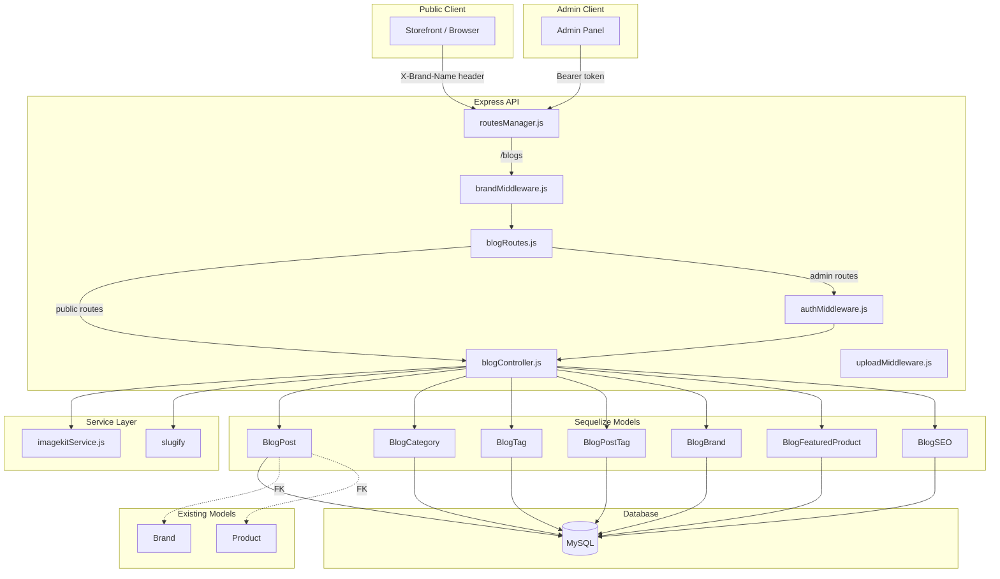
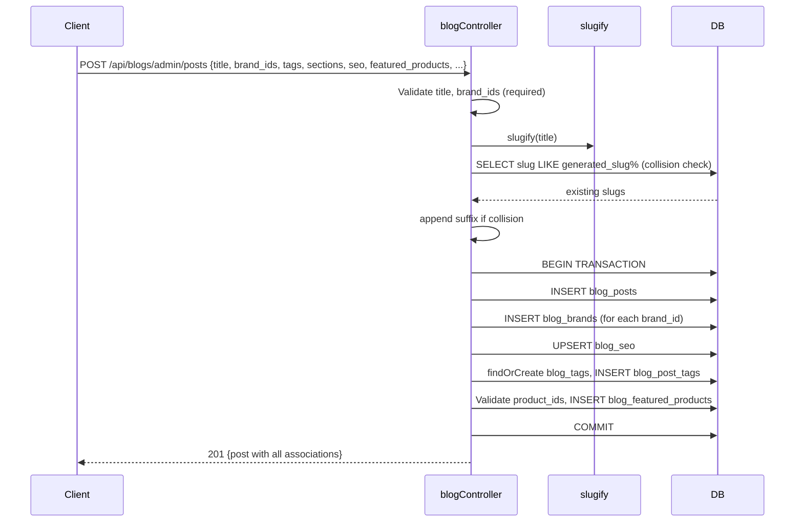

# Design Document: Blog Management

## Overview

The Blog Management feature adds a full-featured blogging system to the multi-brand e-commerce backend. Blog posts are brand-scoped via a junction table (consistent with the existing `ProductBrand` / `SliderBrand` pattern), carry rich JSON content sections, support tags and blog-specific categories, link to existing products as featured items, include per-post SEO metadata, and have a hero image uploaded via ImageKit.

Public APIs are scoped by brand through the `X-Brand-Name` header resolved by `Brand_Middleware`. Admin APIs operate across all brands without brand filtering and require JWT authentication.

The implementation follows the established patterns in the codebase: Sequelize models with `utf8mb4_general_ci` charset, `associations.js` for all relationships, `imagekitService.js` for image uploads, `slugify` for slug generation, and `sequelize.transaction()` for multi-table writes.

---

## Architecture



---

## Components and Interfaces

### New Files

| File | Purpose |
|------|---------|
| `Backend/model/blogPostModel.js` | BlogPost Sequelize model |
| `Backend/model/blogCategoryModel.js` | BlogCategory Sequelize model |
| `Backend/model/blogTagModel.js` | BlogTag Sequelize model |
| `Backend/model/blogPostTagModel.js` | Junction: blog_post ↔ blog_tag |
| `Backend/model/blogBrandModel.js` | Junction: blog_post ↔ brand |
| `Backend/model/blogFeaturedProductModel.js` | Junction: blog_post ↔ product + lifestyle_tag |
| `Backend/model/blogSeoModel.js` | BlogSEO (mirrors productSEOModel.js) |
| `Backend/controller/blogController.js` | All blog + category CRUD, hero image upload |
| `Backend/routes/blogRoutes.js` | Public + admin route definitions |
| `Backend/migrations/blog_tables.sql` | Standalone DDL for all 7 tables |

### Modified Files

| File | Change |
|------|--------|
| `Backend/model/associations.js` | Import 7 blog models, register all associations, add to exports |
| `Backend/routes/routesManager.js` | Mount `blogRoutes` at `/blogs` with `identifyBrand` |
| `Backend/scripts/setupDatabase.js` | Add `createBlogTables()` called after `sequelize.sync()` |

### Route Interface

**Public routes** (brand-scoped via `identifyBrand` middleware):

| Method | Path | Description |
|--------|------|-------------|
| GET | `/api/blogs/public` | List published posts for brand (filters: category, tag, page, limit) |
| GET | `/api/blogs/public/:slug` | Single published post by slug for brand |
| GET | `/api/blogs/tags` | All tags with post counts |

**Admin routes** (JWT auth required via `isAuthenticated` + `authorize(['admin'])`):

| Method | Path | Description |
|--------|------|-------------|
| POST | `/api/blogs/admin/categories` | Create blog category |
| GET | `/api/blogs/admin/categories` | List all blog categories |
| PUT | `/api/blogs/admin/categories/:id` | Update blog category |
| DELETE | `/api/blogs/admin/categories/:id` | Delete blog category |
| POST | `/api/blogs/admin/posts` | Create blog post (transaction) |
| GET | `/api/blogs/admin/posts` | List all posts (filters: brand_id, status, category_id, page, limit) |
| GET | `/api/blogs/admin/posts/:id` | Get single post with all associations |
| PUT | `/api/blogs/admin/posts/:id` | Update blog post (transaction) |
| DELETE | `/api/blogs/admin/posts/:id` | Delete blog post + cascade (transaction) |
| POST | `/api/blogs/admin/posts/:id/hero-image` | Upload hero image via ImageKit |


---

## Data Models

### blog_categories

| Column | Type | Constraints |
|--------|------|-------------|
| id | INT | PK, AUTO_INCREMENT |
| name | VARCHAR(255) | NOT NULL |
| slug | VARCHAR(255) | NOT NULL, UNIQUE |
| description | TEXT | NULL |
| status | ENUM('active','inactive') | DEFAULT 'active' |
| created_at | DATETIME | DEFAULT CURRENT_TIMESTAMP |
| updated_at | DATETIME | ON UPDATE CURRENT_TIMESTAMP |

### blog_posts

| Column | Type | Constraints |
|--------|------|-------------|
| id | INT | PK, AUTO_INCREMENT |
| title | VARCHAR(500) | NOT NULL |
| slug | VARCHAR(500) | NOT NULL, UNIQUE |
| author_name | VARCHAR(255) | NULL |
| hero_image | VARCHAR(1000) | NULL |
| sections | JSON | NULL |
| status | ENUM('draft','published','archived') | DEFAULT 'draft' |
| published_at | DATETIME | NULL |
| blog_category_id | INT | NULL, FK → blog_categories(id) ON DELETE SET NULL |
| created_at | DATETIME | DEFAULT CURRENT_TIMESTAMP |
| updated_at | DATETIME | ON UPDATE CURRENT_TIMESTAMP |

Indexes: `slug` (UNIQUE), `status`, `blog_category_id`, `published_at`

### blog_tags

| Column | Type | Constraints |
|--------|------|-------------|
| id | INT | PK, AUTO_INCREMENT |
| name | VARCHAR(255) | NOT NULL, UNIQUE |
| slug | VARCHAR(255) | NOT NULL, UNIQUE |
| created_at | DATETIME | DEFAULT CURRENT_TIMESTAMP |
| updated_at | DATETIME | ON UPDATE CURRENT_TIMESTAMP |

### blog_post_tags (junction)

| Column | Type | Constraints |
|--------|------|-------------|
| blog_post_id | INT | PK (composite), FK → blog_posts(id) ON DELETE CASCADE |
| blog_tag_id | INT | PK (composite), FK → blog_tags(id) ON DELETE CASCADE |

### blog_brands (junction)

| Column | Type | Constraints |
|--------|------|-------------|
| blog_post_id | INT | PK (composite), FK → blog_posts(id) ON DELETE CASCADE |
| brand_id | INT | PK (composite), FK → brands(id) ON DELETE CASCADE |

### blog_featured_products (junction)

| Column | Type | Constraints |
|--------|------|-------------|
| blog_post_id | INT | PK (composite), FK → blog_posts(id) ON DELETE CASCADE |
| product_id | INT | PK (composite), FK → products(id) ON DELETE CASCADE |
| lifestyle_tag | VARCHAR(255) | NULL |

### blog_seo

| Column | Type | Constraints |
|--------|------|-------------|
| id | INT | PK, AUTO_INCREMENT |
| blog_post_id | INT | NOT NULL, UNIQUE, FK → blog_posts(id) ON DELETE CASCADE |
| meta_title | VARCHAR(255) | NULL |
| meta_description | TEXT | NULL |
| meta_keywords | VARCHAR(500) | NULL |
| og_title | VARCHAR(255) | NULL |
| og_description | TEXT | NULL |
| og_image | VARCHAR(1000) | NULL |
| canonical_url | VARCHAR(1000) | NULL |
| structured_data | JSON | NULL |
| created_at | DATETIME | DEFAULT CURRENT_TIMESTAMP |
| updated_at | DATETIME | ON UPDATE CURRENT_TIMESTAMP |

### Sequelize Associations (registered in associations.js)

```
BlogPost.belongsTo(BlogCategory,       { foreignKey: 'blog_category_id', as: 'BlogCategory' })
BlogCategory.hasMany(BlogPost,         { foreignKey: 'blog_category_id', as: 'BlogPosts' })

BlogPost.belongsToMany(Brand,          { through: BlogBrand,          foreignKey: 'blog_post_id', otherKey: 'brand_id',    as: 'Brands' })
Brand.belongsToMany(BlogPost,          { through: BlogBrand,          foreignKey: 'brand_id',    otherKey: 'blog_post_id', as: 'BlogPosts' })

BlogPost.belongsToMany(BlogTag,        { through: BlogPostTag,        foreignKey: 'blog_post_id', otherKey: 'blog_tag_id', as: 'Tags' })
BlogTag.belongsToMany(BlogPost,        { through: BlogPostTag,        foreignKey: 'blog_tag_id',  otherKey: 'blog_post_id', as: 'BlogPosts' })

BlogPost.belongsToMany(Product,        { through: BlogFeaturedProduct, foreignKey: 'blog_post_id', otherKey: 'product_id', as: 'FeaturedProducts' })
Product.belongsToMany(BlogPost,        { through: BlogFeaturedProduct, foreignKey: 'product_id',  otherKey: 'blog_post_id', as: 'BlogPosts' })

BlogPost.hasOne(BlogSEO,               { foreignKey: 'blog_post_id', as: 'BlogSEO' })
BlogSEO.belongsTo(BlogPost,            { foreignKey: 'blog_post_id', as: 'BlogPost' })
```

---

## Data Flow: Create Blog Post



---

## SQL Schema (blog_tables.sql)

```sql
-- blog_categories
CREATE TABLE IF NOT EXISTS blog_categories (
  id INT NOT NULL AUTO_INCREMENT,
  name VARCHAR(255) NOT NULL,
  slug VARCHAR(255) NOT NULL,
  description TEXT NULL,
  status ENUM('active','inactive') NOT NULL DEFAULT 'active',
  created_at DATETIME NOT NULL DEFAULT CURRENT_TIMESTAMP,
  updated_at DATETIME NOT NULL DEFAULT CURRENT_TIMESTAMP ON UPDATE CURRENT_TIMESTAMP,
  PRIMARY KEY (id),
  UNIQUE KEY uq_blog_categories_slug (slug)
) ENGINE=InnoDB DEFAULT CHARSET=utf8mb4 COLLATE=utf8mb4_general_ci;

-- blog_posts
CREATE TABLE IF NOT EXISTS blog_posts (
  id INT NOT NULL AUTO_INCREMENT,
  title VARCHAR(500) NOT NULL,
  slug VARCHAR(500) NOT NULL,
  author_name VARCHAR(255) NULL,
  hero_image VARCHAR(1000) NULL,
  sections JSON NULL,
  status ENUM('draft','published','archived') NOT NULL DEFAULT 'draft',
  published_at DATETIME NULL,
  blog_category_id INT NULL,
  created_at DATETIME NOT NULL DEFAULT CURRENT_TIMESTAMP,
  updated_at DATETIME NOT NULL DEFAULT CURRENT_TIMESTAMP ON UPDATE CURRENT_TIMESTAMP,
  PRIMARY KEY (id),
  UNIQUE KEY uq_blog_posts_slug (slug),
  KEY idx_blog_posts_status (status),
  KEY idx_blog_posts_category (blog_category_id),
  KEY idx_blog_posts_published_at (published_at),
  CONSTRAINT fk_blog_posts_category
    FOREIGN KEY (blog_category_id) REFERENCES blog_categories (id)
    ON DELETE SET NULL ON UPDATE CASCADE
) ENGINE=InnoDB DEFAULT CHARSET=utf8mb4 COLLATE=utf8mb4_general_ci;

-- blog_tags
CREATE TABLE IF NOT EXISTS blog_tags (
  id INT NOT NULL AUTO_INCREMENT,
  name VARCHAR(255) NOT NULL,
  slug VARCHAR(255) NOT NULL,
  created_at DATETIME NOT NULL DEFAULT CURRENT_TIMESTAMP,
  updated_at DATETIME NOT NULL DEFAULT CURRENT_TIMESTAMP ON UPDATE CURRENT_TIMESTAMP,
  PRIMARY KEY (id),
  UNIQUE KEY uq_blog_tags_name (name),
  UNIQUE KEY uq_blog_tags_slug (slug)
) ENGINE=InnoDB DEFAULT CHARSET=utf8mb4 COLLATE=utf8mb4_general_ci;

-- blog_post_tags
CREATE TABLE IF NOT EXISTS blog_post_tags (
  blog_post_id INT NOT NULL,
  blog_tag_id INT NOT NULL,
  PRIMARY KEY (blog_post_id, blog_tag_id),
  CONSTRAINT fk_bpt_post FOREIGN KEY (blog_post_id) REFERENCES blog_posts (id) ON DELETE CASCADE ON UPDATE CASCADE,
  CONSTRAINT fk_bpt_tag  FOREIGN KEY (blog_tag_id)  REFERENCES blog_tags  (id) ON DELETE CASCADE ON UPDATE CASCADE
) ENGINE=InnoDB DEFAULT CHARSET=utf8mb4 COLLATE=utf8mb4_general_ci;

-- blog_brands
CREATE TABLE IF NOT EXISTS blog_brands (
  blog_post_id INT NOT NULL,
  brand_id     INT NOT NULL,
  PRIMARY KEY (blog_post_id, brand_id),
  CONSTRAINT fk_bb_post  FOREIGN KEY (blog_post_id) REFERENCES blog_posts (id) ON DELETE CASCADE ON UPDATE CASCADE,
  CONSTRAINT fk_bb_brand FOREIGN KEY (brand_id)     REFERENCES brands     (id) ON DELETE CASCADE ON UPDATE CASCADE
) ENGINE=InnoDB DEFAULT CHARSET=utf8mb4 COLLATE=utf8mb4_general_ci;

-- blog_featured_products
CREATE TABLE IF NOT EXISTS blog_featured_products (
  blog_post_id  INT NOT NULL,
  product_id    INT NOT NULL,
  lifestyle_tag VARCHAR(255) NULL,
  PRIMARY KEY (blog_post_id, product_id),
  CONSTRAINT fk_bfp_post    FOREIGN KEY (blog_post_id) REFERENCES blog_posts (id) ON DELETE CASCADE ON UPDATE CASCADE,
  CONSTRAINT fk_bfp_product FOREIGN KEY (product_id)   REFERENCES products   (id) ON DELETE CASCADE ON UPDATE CASCADE
) ENGINE=InnoDB DEFAULT CHARSET=utf8mb4 COLLATE=utf8mb4_general_ci;

-- blog_seo
CREATE TABLE IF NOT EXISTS blog_seo (
  id              INT NOT NULL AUTO_INCREMENT,
  blog_post_id    INT NOT NULL,
  meta_title      VARCHAR(255) NULL,
  meta_description TEXT NULL,
  meta_keywords   VARCHAR(500) NULL,
  og_title        VARCHAR(255) NULL,
  og_description  TEXT NULL,
  og_image        VARCHAR(1000) NULL,
  canonical_url   VARCHAR(1000) NULL,
  structured_data JSON NULL,
  created_at      DATETIME NOT NULL DEFAULT CURRENT_TIMESTAMP,
  updated_at      DATETIME NOT NULL DEFAULT CURRENT_TIMESTAMP ON UPDATE CURRENT_TIMESTAMP,
  PRIMARY KEY (id),
  UNIQUE KEY uq_blog_seo_post (blog_post_id),
  CONSTRAINT fk_bs_post FOREIGN KEY (blog_post_id) REFERENCES blog_posts (id) ON DELETE CASCADE ON UPDATE CASCADE
) ENGINE=InnoDB DEFAULT CHARSET=utf8mb4 COLLATE=utf8mb4_general_ci;
```


---

## Correctness Properties

*A property is a characteristic or behavior that should hold true across all valid executions of a system — essentially, a formal statement about what the system should do. Properties serve as the bridge between human-readable specifications and machine-verifiable correctness guarantees.*

### Property 1: Blog post creation round-trip

*For any* valid blog post payload (with title and at least one brand_id), creating a post via POST and then fetching it by the returned ID should return a record whose title, author_name, status, brand associations, and tag associations match the original payload.

**Validates: Requirements 1.1, 1.3, 2.1, 13.2**

---

### Property 2: Blog post update round-trip

*For any* existing blog post and any valid update payload, calling PUT and then fetching the post should return a record whose fields, brand associations, tag associations, featured products, and SEO data reflect the updated values.

**Validates: Requirements 1.4, 2.3, 4.4, 6.4**

---

### Property 3: Blog post deletion cascades

*For any* existing blog post with associated brands, tags, featured products, and SEO, deleting the post should result in the post being unfetchable and all associated junction rows (blog_brands, blog_post_tags, blog_featured_products, blog_seo) being removed.

**Validates: Requirements 1.5, 1.8**

---

### Property 4: Slug generation from title

*For any* title string, the slug stored on the created blog post should equal `slugify(title, { lower: true, strict: true })`. When two posts share the same title, the second slug should differ from the first by a numeric suffix.

**Validates: Requirements 1.6, 1.7, 9.1, 9.2**

---

### Property 5: brand_ids required validation

*For any* create request that omits `brand_ids` or provides an empty array, the response status should be 400 and no blog post record should be created.

**Validates: Requirements 2.2**

---

### Property 6: Blog category CRUD round-trip

*For any* valid category payload, creating a category and then fetching it by ID should return a record with matching name and slug. Updating the category and re-fetching should reflect the new values. Deleting the category should make it unfetchable.

**Validates: Requirements 3.1**

---

### Property 7: Category deletion nullifies blog_category_id

*For any* blog post associated with a blog category, deleting that category should result in the post's `blog_category_id` being NULL when the post is subsequently fetched.

**Validates: Requirements 3.3**

---

### Property 8: Tags round-trip with findOrCreate

*For any* array of tag strings provided on post creation (including tags that do not yet exist in the database), fetching the created post should return all those tags in its `Tags` association, and each tag should exist in the `blog_tags` table.

**Validates: Requirements 4.2, 4.3**

---

### Property 9: Tags endpoint returns accurate post counts

*For any* set of blog posts and tags, the GET `/api/blogs/tags` response should include every tag that has at least one associated post, and the `post_count` for each tag should equal the number of published posts associated with that tag.

**Validates: Requirements 4.5**

---

### Property 10: Sections JSON round-trip

*For any* valid JSON array provided as `sections` on create or update, fetching the post should return the `sections` field as a parsed JavaScript array equal in structure to the original input.

**Validates: Requirements 5.2, 5.4**

---

### Property 11: Invalid sections value returns 400

*For any* create or update request where `sections` is provided but is not a valid JSON array (e.g., a plain string, a JSON object, or malformed JSON), the response status should be 400 and no post should be created or modified.

**Validates: Requirements 5.3**

---

### Property 12: Featured products round-trip

*For any* array of `{ product_id, lifestyle_tag }` objects referencing valid products, creating or updating a post with those featured products and then fetching the post should return all featured products with their id, name, slug, and lifestyle_tag.

**Validates: Requirements 6.2, 6.5**

---

### Property 13: Invalid product_id returns 422

*For any* create or update request containing a `product_id` that does not reference an existing Product record, the response status should be 422 and no post should be created or modified.

**Validates: Requirements 6.3**

---

### Property 14: SEO upsert round-trip

*For any* blog post created or updated with a `seo` object, fetching the post should return a `seo` key whose fields match the provided values. When no `seo` object is provided, the `seo` key should be present with all fields set to null.

**Validates: Requirements 7.3, 7.4, 7.5**

---

### Property 15: Hero image upload updates hero_image

*For any* existing blog post and any valid image file (image/jpeg, image/png, or image/webp), uploading via POST `/:id/hero-image` should result in the post's `hero_image` field being updated to a non-null CDN URL.

**Validates: Requirements 8.1, 8.3**

---

### Property 16: Non-image MIME type returns 400

*For any* file upload request where the MIME type is not one of image/jpeg, image/png, or image/webp, the response status should be 400 and the post's `hero_image` field should remain unchanged.

**Validates: Requirements 8.4**

---

### Property 17: published_at auto-set on first publish

*For any* blog post with `published_at = NULL`, setting `status` to `'published'` should result in `published_at` being set to a non-null UTC timestamp close to the current time.

**Validates: Requirements 10.3**

---

### Property 18: published_at retained on status change away from published

*For any* blog post that has a non-null `published_at`, changing `status` to `'draft'` or `'archived'` should leave `published_at` unchanged.

**Validates: Requirements 10.4**

---

### Property 19: Public API excludes non-published posts

*For any* brand and any set of blog posts in that brand, the public GET `/api/blogs/public` response should contain only posts with `status = 'published'`, never draft or archived posts.

**Validates: Requirements 10.5, 11.1**

---

### Property 20: Public API is brand-scoped

*For any* two brands A and B with disjoint sets of published posts, a public request with brand A's `X-Brand-Name` header should return only brand A's posts and never brand B's posts.

**Validates: Requirements 11.1, 11.2**

---

### Property 21: Pagination and filter parameters are respected

*For any* set of published posts and any combination of `category`, `tag`, `page`, and `limit` query parameters, the response should contain only posts matching all provided filters, and the number of results should not exceed `limit`.

**Validates: Requirements 11.5, 12.3**

---

### Property 22: Limit parameter is clamped

*For any* request to the public listing endpoint with `limit > 50`, the number of returned posts should not exceed 50. For any request to the admin listing endpoint with `limit > 100`, the number of returned posts should not exceed 100.

**Validates: Requirements 11.6, 12.4**

---

### Property 23: Admin routes require authentication

*For any* request to an `/api/blogs/admin/*` route that lacks a valid Bearer token, the response status should be 401.

**Validates: Requirements 12.1**

---

### Property 24: Admin API returns posts across all brands and statuses

*For any* set of blog posts spanning multiple brands and statuses, the admin GET `/api/blogs/admin/posts` response (with no filters) should include all posts regardless of brand or status.

**Validates: Requirements 12.2**

---

## Error Handling

| Scenario | HTTP Status | Response |
|----------|-------------|----------|
| Missing or empty `brand_ids` | 400 | `{ success: false, message: 'brand_ids is required and must be a non-empty array' }` |
| `sections` is not a valid JSON array | 400 | `{ success: false, message: 'sections must be a valid JSON array' }` |
| Hero image MIME type not allowed | 400 | `{ success: false, message: 'Only image/jpeg, image/png, and image/webp are accepted' }` |
| `product_id` not found in products table | 422 | `{ success: false, message: 'Product with id {id} does not exist' }` |
| Slug collision (unique constraint violation) | 409 | `{ success: false, message: 'A blog post with this slug already exists' }` |
| Missing `X-Brand-Name` header on public routes | 400 | `{ success: false, message: 'Brand identifier required. Please provide X-Brand-Name header' }` |
| Blog post not found by ID or slug | 404 | `{ success: false, message: 'Blog post not found' }` |
| Blog category not found | 404 | `{ success: false, message: 'Blog category not found' }` |
| Unauthenticated admin request | 401 | `{ message: 'No token, authorization denied' }` |
| Unauthorized (non-admin) admin request | 403 | `{ message: 'Access denied' }` |
| Unexpected server error | 500 | `{ success: false, message: 'Internal server error', error: error.message }` |

### Transaction Pattern

All multi-table writes (create, update, delete) use `sequelize.transaction()`:

```js
const t = await sequelize.transaction();
try {
  // ... all DB operations pass { transaction: t }
  await t.commit();
} catch (err) {
  await t.rollback();
  throw err;
}
```

### Slug Collision Handling

```js
let slug = slugify(title, { lower: true, strict: true });
const existing = await BlogPost.findAll({
  where: { slug: { [Op.like]: `${slug}%` } },
  attributes: ['slug']
});
if (existing.length > 0) {
  slug = `${slug}-${existing.length + 1}`;
}
```

### published_at Auto-Set Logic

```js
if (status === 'published' && !published_at) {
  published_at = new Date();
}
// On update: only set if transitioning to published and currently null
if (status === 'published' && !post.published_at) {
  updateData.published_at = new Date();
}
```

### Brand-Scoped Query Pattern

Public listing queries join through `blog_brands` to filter by `req.brandId`:

```js
include: [{
  model: Brand,
  as: 'Brands',
  through: { attributes: [] },
  where: { id: req.brandId },
  required: true
}]
```

---

## Testing Strategy

### Dual Testing Approach

Both unit tests and property-based tests are required for comprehensive coverage. Unit tests catch concrete bugs in specific scenarios; property-based tests verify general correctness across all inputs.

**Unit tests** focus on:
- Specific examples demonstrating correct behavior (e.g., a post with known title produces the expected slug)
- Integration points between components (e.g., controller correctly calls imagekitService)
- Edge cases: slug collision, missing brand_ids, null author_name, no seo object, limit clamping, missing X-Brand-Name header

**Property-based tests** focus on:
- Universal properties that hold for all valid inputs (all 24 properties above)
- Comprehensive input coverage through randomization

### Property-Based Testing Library

Use **[fast-check](https://github.com/dubzzz/fast-check)** for Node.js/JavaScript property-based testing.

```
npm install --save-dev fast-check
```

### Property Test Configuration

- Minimum **100 iterations** per property test (`numRuns: 100` in fast-check)
- Each property test must reference its design document property via a comment tag
- Tag format: `// Feature: blog-management, Property {N}: {property_text}`
- Each correctness property must be implemented by a **single** property-based test

### Example Property Test Structure

```js
const fc = require('fast-check');

// Feature: blog-management, Property 4: Slug generation from title
test('slug is derived from title via slugify', () => {
  fc.assert(
    fc.property(fc.string({ minLength: 1 }), (title) => {
      const expected = slugify(title, { lower: true, strict: true });
      const result = generateSlug(title);
      return result === expected;
    }),
    { numRuns: 100 }
  );
});
```

### Test File Location

```
Backend/tests/
  blog.unit.test.js       — unit tests for specific examples and edge cases
  blog.property.test.js   — property-based tests for all 24 correctness properties
```

### Coverage Targets

| Area | Approach |
|------|----------|
| Slug generation | Property test (P4) |
| Brand association round-trip | Property test (P1, P2) |
| Tag findOrCreate | Property test (P8) |
| Sections JSON round-trip | Property test (P10) |
| Status/published_at logic | Property test (P17, P18) |
| Public brand scoping | Property test (P19, P20) |
| Pagination/filtering | Property test (P21, P22) |
| Validation errors (400/422/409) | Unit tests + property tests (P5, P11, P13, P16) |
| Auth enforcement | Property test (P23) |
| Cascade deletion | Property test (P3) |
| SEO upsert | Property test (P14) |
| Hero image upload | Unit test (mock imagekitService) + property test (P15) |
