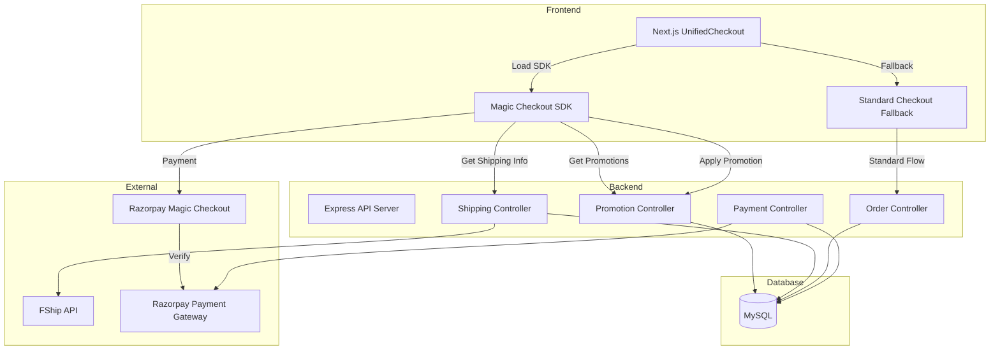
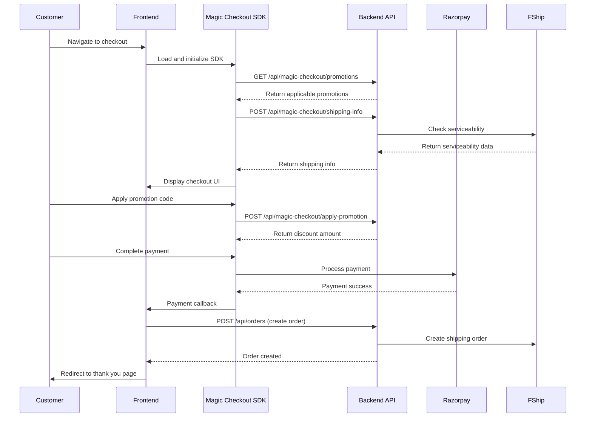

# Design Document: Razorpay Magic Checkout Integration

## Overview

This design document outlines the technical approach for integrating Razorpay Magic Checkout into the Cross Coin e-commerce platform. The integration replaces the standard Razorpay checkout with Magic Checkout, which provides enhanced features including saved addresses, saved payment methods, address quality validation, and COD serviceability checks.

The design maintains backward compatibility with existing order flows while introducing three new API endpoints required by Magic Checkout: get promotions, apply promotions, and shipping info. The frontend will be updated to use the Magic Checkout SDK instead of the standard checkout.js library.

Key design principles:
- Maintain existing database schema and order creation logic
- Preserve FShip shipping integration
- Support both authenticated and guest checkout flows
- Implement graceful fallback to standard checkout if Magic Checkout fails
- Ensure consistent promotion and shipping fee calculations

## Architecture

### System Components



### Integration Flow

1. **Checkout Initialization**
   - Frontend loads Magic Checkout SDK from Razorpay CDN
   - SDK initializes with merchant key and order context
   - If SDK fails to load, fallback to standard checkout

2. **Address and Promotion Loading**
   - Magic Checkout calls get promotions endpoint with order_id and customer info
   - Magic Checkout calls shipping info endpoint with customer addresses
   - Frontend displays saved addresses and applicable promotions

3. **Promotion Application**
   - Customer selects or enters promotion code
   - Magic Checkout calls apply promotion endpoint
   - Backend validates and returns discount amount
   - Frontend updates order total

4. **Payment Processing**
   - Customer selects payment method (saved or new)
   - Magic Checkout processes payment through Razorpay
   - Backend receives payment callback with Magic Checkout identifiers
   - Backend verifies payment signature and creates order

5. **Order Fulfillment**
   - Order is created with payment details
   - FShip integration creates shipping order
   - Customer receives order confirmation

### Data Flow



## Components and Interfaces

### Backend API Endpoints

#### 1. Get Promotions Endpoint

**Endpoint:** `GET /api/magic-checkout/promotions`

**Query Parameters:**
- `order_id` (string, required): Razorpay order ID
- `customer_id` (string, optional): Customer identifier (user ID or guest email)
- `cart_total` (number, required): Total cart amount in paise

**Response Format:**
```json
{
  "promotions": [
    {
      "code": "WELCOME10",
      "description": "10% off on first order",
      "type": "percentage",
      "value": 10,
      "min_purchase": 50000,
      "max_discount": 10000,
      "applicable": true
    }
  ]
}
```

**Business Logic:**
- Query active coupons from database
- Filter by start/end date
- Check usage limits (total and per-user)
- Validate minimum purchase requirements
- Calculate discount amounts for percentage coupons
- Return only applicable promotions

#### 2. Apply Promotion Endpoint

**Endpoint:** `POST /api/magic-checkout/apply-promotion`

**Request Body:**
```json
{
  "order_id": "order_abc123",
  "promotion_code": "WELCOME10",
  "customer_id": "user_123",
  "cart_total": 100000,
  "cart_items": [
    {
      "product_id": 1,
      "quantity": 2,
      "price": 50000
    }
  ]
}
```

**Response Format:**
```json
{
  "success": true,
  "discount_amount": 10000,
  "final_amount": 90000,
  "promotion": {
    "code": "WELCOME10",
    "description": "10% off on first order"
  }
}
```

**Business Logic:**
- Validate promotion code exists and is active
- Check usage limits
- Validate cart items against promotion applicability
- Calculate discount amount
- Return discount and updated total

#### 3. Shipping Info Endpoint

**Endpoint:** `POST /api/magic-checkout/shipping-info`

**Request Body:**
```json
{
  "order_id": "order_abc123",
  "addresses": [
    {
      "id": "addr_1",
      "line1": "123 Main St",
      "line2": "Apt 4B",
      "city": "Mumbai",
      "state": "Maharashtra",
      "pincode": "400001",
      "phone": "9876543210"
    }
  ],
  "cart_total": 100000,
  "payment_method": "prepaid"
}
```

**Response Format:**
```json
{
  "shipping_info": [
    {
      "address_id": "addr_1",
      "serviceable": true,
      "cod_available": true,
      "shipping_fee": 0,
      "cod_fee": 599,
      "estimated_delivery_days": 3,
      "address_quality_score": 85
    }
  ]
}
```

**Business Logic:**
- Validate address completeness
- Check FShip serviceability for pincode
- Calculate address quality score
- Determine COD availability based on address quality
- Calculate shipping fees based on payment method
- Calculate COD fees if applicable
- Return serviceability data for each address

### Frontend Components

#### Magic Checkout Integration Component

**File:** `Frontend/src/components/checkout/MagicCheckoutIntegration.jsx`

**Props:**
- `cartItems`: Array of cart items
- `user`: Authenticated user object (null for guest)
- `onSuccess`: Callback for successful payment
- `onError`: Callback for payment errors

**State:**
- `sdkLoaded`: Boolean indicating SDK load status
- `magicCheckoutInstance`: Magic Checkout SDK instance
- `promotions`: Array of available promotions
- `selectedPromotion`: Currently applied promotion
- `shippingInfo`: Shipping serviceability data
- `selectedAddress`: Customer's selected address

**Methods:**
- `loadMagicCheckoutSDK()`: Dynamically load SDK from CDN
- `initializeMagicCheckout()`: Initialize SDK with config
- `fetchPromotions()`: Call get promotions endpoint
- `applyPromotion(code)`: Call apply promotion endpoint
- `fetchShippingInfo(addresses)`: Call shipping info endpoint
- `handlePayment()`: Process payment through Magic Checkout
- `fallbackToStandardCheckout()`: Switch to standard checkout on error

#### Updated UnifiedCheckout Component

**File:** `Frontend/src/pages/UnifiedCheckout.jsx`

**Changes:**
- Import and use MagicCheckoutIntegration component
- Add feature flag check for Magic Checkout
- Maintain standard checkout as fallback
- Pass cart and user data to Magic Checkout component
- Handle Magic Checkout callbacks

### Database Schema

No changes to existing schema required. The integration uses existing tables:
- `orders`: Store order details
- `payments`: Store payment information
- `coupons`: Store promotion codes
- `coupon_usage`: Track coupon usage
- `shipping_addresses`: Store customer addresses
- `shipping_fees`: Store shipping fee configuration

New optional fields for `payments` table (via migration):
- `magic_checkout_order_id` (VARCHAR(255)): Magic Checkout order identifier
- `magic_checkout_payment_id` (VARCHAR(255)): Magic Checkout payment identifier
- `magic_checkout_signature` (VARCHAR(255)): Payment signature for verification

## Data Models

### Promotion Data Model

```typescript
interface Promotion {
  id: number;
  code: string;
  description: string;
  type: 'percentage' | 'fixed';
  value: number;
  minPurchase: number | null;
  maxDiscount: number | null;
  startDate: Date;
  endDate: Date;
  usageLimit: number | null;
  usageCount: number;
  perUserLimit: number | null;
  status: 'active' | 'inactive';
  applicableCategories: number[] | null;
  applicableProducts: number[] | null;
}
```

### Shipping Info Data Model

```typescript
interface ShippingInfo {
  addressId: string;
  serviceable: boolean;
  codAvailable: boolean;
  shippingFee: number;
  codFee: number;
  estimatedDeliveryDays: number;
  addressQualityScore: number;
  reason?: string; // If not serviceable
}
```

### Address Quality Data Model

```typescript
interface AddressQuality {
  score: number; // 0-100
  factors: {
    pincodeValid: boolean;
    phoneValid: boolean;
    addressComplete: boolean;
    historicalDeliverySuccess: number; // 0-100
  };
  recommendation: 'prepaid' | 'cod' | 'either';
}
```

### Magic Checkout Order Context

```typescript
interface MagicCheckoutContext {
  orderId: string;
  amount: number; // in paise
  currency: string;
  customer: {
    id?: string;
    email: string;
    phone: string;
    name: string;
  };
  items: Array<{
    productId: number;
    name: string;
    quantity: number;
    price: number;
  }>;
  merchantKey: string;
}
```

## Correctness Properties

*A property is a characteristic or behavior that should hold true across all valid executions of a system—essentially, a formal statement about what the system should do. Properties serve as the bridge between human-readable specifications and machine-verifiable correctness guarantees.*

